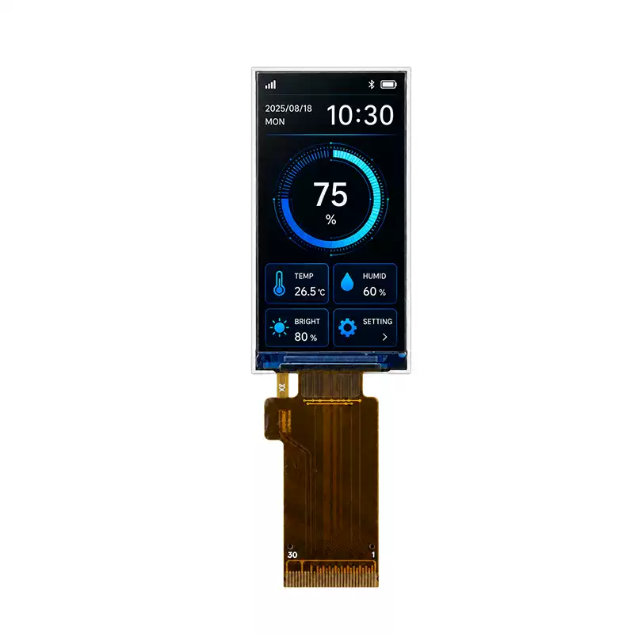

<p align="left"></p>

<h1 align="center">OSPTEK 1.9″ TFT 170×320 (ST7789 · SPI / I80)</h1>

<p align="center"><b>TFT module · SPI / I80 · ST7789</b></p>

<p align="center"><a href="./README.md">简体中文</a> | English · <a href="../../README_EN.md">Family index</a></p>

<p align="center">
  
  
  
  
</p>

<p align="center"></p>

## Contents

- [Overview](#overview)
- [Specifications](#specifications)
- [Repository layout](#repository-layout)
- [Resources](#resources)
- [Buy](#buy)
- [Support](#support)

---

## Overview

OSPTEK **1.9″ 170×320 TFT** is a color display module that can run **SPI** or **I80**. The display driver is **ST7789**. Suited to handheld devices, wearables, and compact portrait HMI. The same part number and FPC select the interface with IM pins.

Spec ID (repository name): `tft-1.9-170x320-spi_i80-st7789`

Current module version: **YDP190H002-V2**. Electrical and mechanical details follow [`docs/YDP190H002-V2.pdf`](./docs/YDP190H002-V2.pdf).

## Specifications

| Item | Spec |
| ---- | ---- |
| Size | 1.9 inch |
| Type | TFT (color, normally black) |
| Resolution | 170×320 |
| Interface | SPI / I80 (IM select: 4-wire SPI or 8080 8-bit) |
| Driver IC | ST7789 |

> Full outline, FPC definition, power, and timing follow the product datasheet / driver IC datasheet.

## Repository layout

```text
tft-1.9-170x320-spi_i80-st7789/             # repo root (nav: ../../README_EN.md)
└── versions/
    └── YDP190H002-V2/                      # full materials for this part number
        ├── README.md
        ├── README_EN.md
        ├── images/
        ├── docs/
        └── examples/
```

## Resources

### Product files

| Resource | Link |
| ---- | ---- |
| Product datasheet (YDP190H002-V2) | [`docs/YDP190H002-V2.pdf`](./docs/YDP190H002-V2.pdf) |

## Buy

<p align="center">
  <a href="https://www.aliexpress.com/store/1105701619"></a>
  &nbsp;&nbsp;
  <a href="https://shop110742373.taobao.com/"></a>
</p>

**Overseas (AliExpress)**

- Store: [OSPTEK Official Store](https://www.aliexpress.com/store/1105701619)

**China (Taobao)**

- Store: [鱼鹰光电工厂店](https://shop110742373.taobao.com/)

## Support

- Technical support / product inquiry: <luyu@osptek.com>
- QQ group: **985881096**
- Website: <https://osptek.com/>
- Feel free to open an Issue in this repository with any questions

---

<p align="center"><sub>© 2026 OSPTEK · Materials in this repository are licensed under CC BY 4.0</sub></p>
